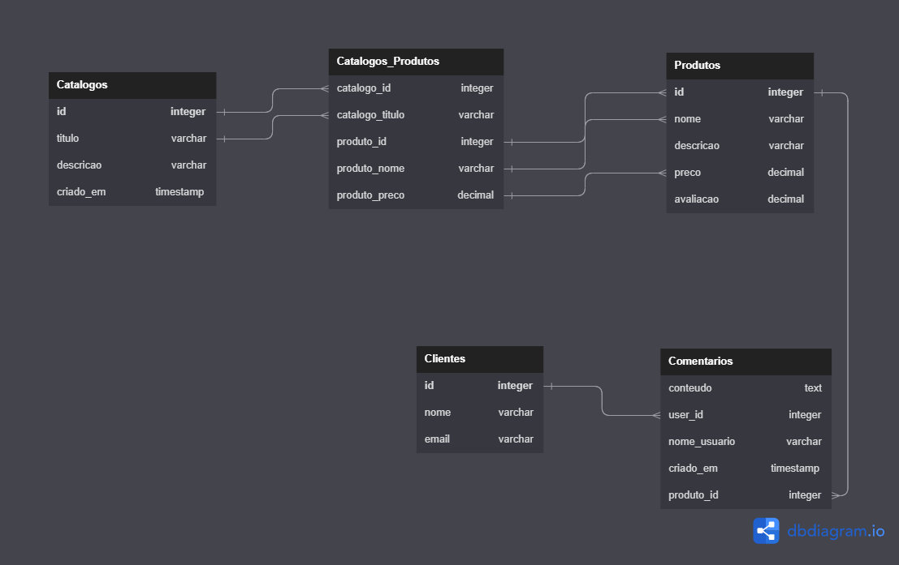

# TestMongoDBCloud

Minimundo:

Clientes cadastrados recebem catalogos. Catalogos tem produtos. Diferentes catalogos podem ter diferentes ou mesmos produtos. Catalgos tem comentarios. Produtos tem nome, preço, descrição e avaliação. Clientes tem nome_usuario, email.

**Database**: "Catalogo_de_produtos":
- **Collections**: 
  - "produtos";
  - "clientes";
  - "catalogos";
  - "catalogos_produtos";
  - "comentários".

Ideia geral:

Modelagem:
  - Código: [database.dbml](database.dbml)
  - Site: https://dbdiagram.io/d

Banco de dados: https://cloud.mongodb.com/
