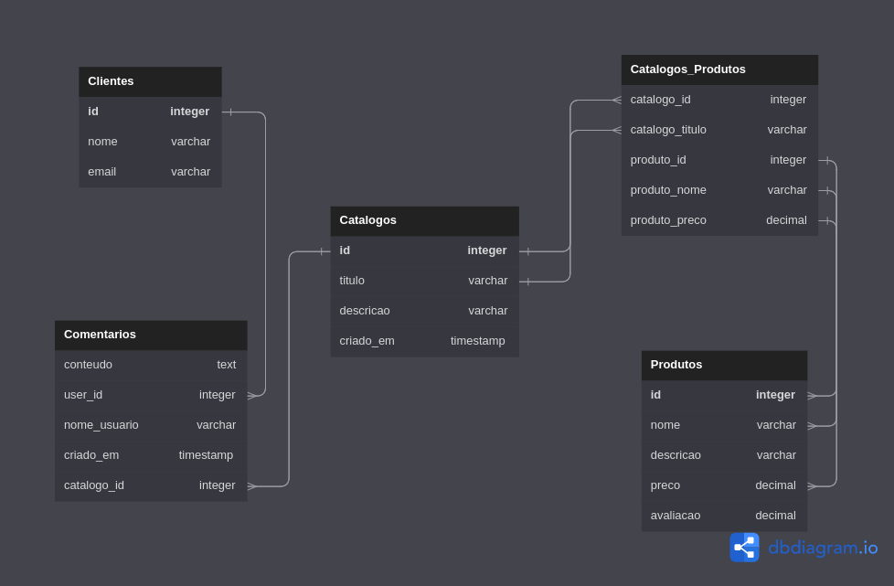

# TestMongoDBCloud-Flask

Minimundo:

Clientes cadastrados recebem catalogos. Catalogos tem produtos. Diferentes catalogos podem ter diferentes ou mesmos produtos. Produtos tem nome, preço, descrição, comentarios(avaliação). Clientes tem nome_usuario, senha.

**Database**: "Catalogo_de_produtos":
- **Collections**: 
  - "produtos";
  - "clientes";
  - "catalogos";
  - "catalogos_produtos";
  - "comentários".

Ideia geral:

Modelagem: https://dbdiagram.io/d

Banco de dados: https://cloud.mongodb.com/
